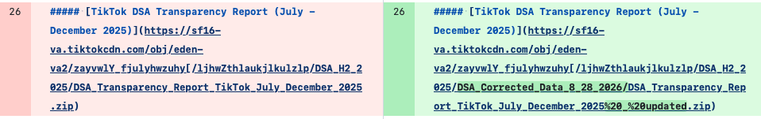
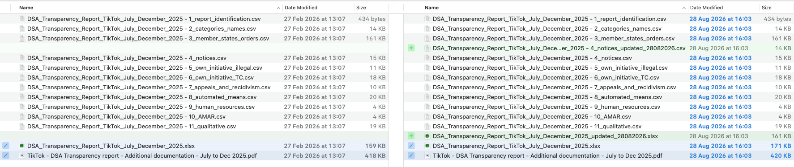
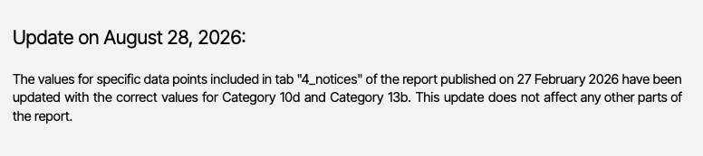
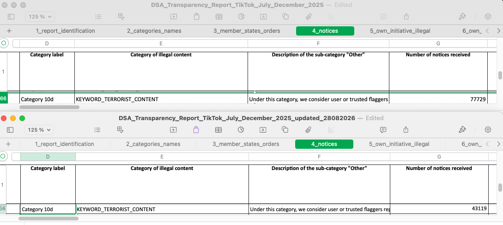

# Updating DSA Transparency Reports: How TikTok’s Silent Correction Tests Implementing Regulation

## Open Terms Archive spotted a change in a TikTok transparency report 6 months after publishing

On 30 August 2026, Open Terms Archive [detected](https://github.com/OpenTermsArchive/dsa-reports-versions/commit/0f2bf601504fe9b4a3e9baa78ba43bc9631e6a49) that TikTok had repointed the download link for its Digital Services Act (DSA) transparency report covering the period of July - December 2025. The report had originally been published on 27 February 2026. Without any public announcement, the canonical download URL was changed to point to a new archive whose name contained “corrected” and “updated”, while the original archive was left accessible at its previous address.

The diff shows a single line change: the link for “TikTok DSA Transparency Report (July - December 2025)” was redirected from the original ZIP file to a new path containing `DSA_Corrected_Data_8_28_2026` and `updated.zip`. No other information on the page was updated to signal that a correction had occurred.

Open Terms Archive detected the change through its [DSA systemic risks reports collection](https://opentermsarchive.org/en/dsa-systemic-risks-reports/), which independently archives published reports and tracks subsequent modifications. Interestingly, in this case, we could catch a _transparency report_ modification even though the collection targets _systemic risks reports_, because both reports are listed on the same page. Since the collection doesn’t track the transparency reports, our analysts could get the information on the change, but could not rely on our archived data and difference detection systems and therefore had to manually investigate.

We downloaded both versions of the ZIP archive containing the report and compared them file by file using a graphical user interface diff tool, [Kaleidoscope](https://kaleidoscope.app).

Most files in the two archives are identical apart from metadata. The meaningful differences are concentrated in three places: the PDF, the CSV file for the “notices” tab, and the XLSX spreadsheet.

## Update notice added to the PDF

We verified the PDF changes using a PDF-to-Markdown conversion followed by a text diff, a conversion that the Open Terms Archive engine performs out-of-the-box. The PDF report’s only change was a prominent update notice on its first page. While the web page does not advertise the update, the report itself does, which is welcome as it gives the reader a clear indication that the values have been amended.

The notice reads:

> Update on August 28, 2026: The values for specific data points included in tab “4_notices” of the report published on 27 February 2026 have been updated with the correct values for Category 10d and Category 13b. This update does not affect any other parts of the report.

At Open Terms Archive, our first design principle is “[never trust the platforms](https://docs.opentermsarchive.org/concepts/design-principles/#1-never-trust-the-services).” We therefore independently verified the scope of the announced correction.

## The “notices” CSV

An XLSX spreadsheet is provided as a database, containing several sheets. Each of these sheets was exported as a CSV file. The CSV file corresponding to the fourth sheet, “notices”, contains data on the content reports received by TikTok. As mentioned in the update notice, two value sets have been changed. The affected columns are the number of notices received, the “number of specific items of information” and the median time to take action, both when the report originates from a trusted flagger and when it does not. Beyond what was announced in the PDF, the table also had its structure slightly altered.

### Value change for terrorist content notices

For Category 10d (terrorist content), the number of notices received fell from 77 729 to 43 119 and the median time to take action fell from 6.82 to 2.43. We could not find the unit used in the table nor in the PDF report itself. Since Regulation (EU) [2021/784 §3](https://eur-lex.europa.eu/eli/reg/2021/784/oj/eng#art_3) requires terrorist content to be removed within a few hours, we assume these are hours. The origin of the data correction can be inferred from the “Description of the sub-category” column, which was also amended: the previous data had been calculated from reports for “Consumer-related offences”, which was corrected to “Terrorist Content”.

A 44 percent drop in reported notices for terrorist content, as well as a threefold decrease in median action time, are material changes to the public record on how the platform handles content reporting. We cannot know how many reports have already been published on this data, nor how many cross-platform comparisons on handling performance have been made. Making it easier for their authors to update their conclusions would be important.

### Value change for “unsafe products”

Category 13b (unsafe products) previously contained no data at all and is populated with values in the new report version. Several other lines have no data in both versions, which raises the question why only this line was corrected.

### Structural changes

Beyond these two rows, the first four columns of the sheet were removed entirely: “Applicability”, “Service”, “Reporting period”, and “Category label”.

The first three were constant across every row (with values, respectively: `All`, `TikTok`, `2025-07-01/2025-12-31`). These values were indeed redundant, since this metadata is already implied by the context: the reader is already looking at the TikTok report for the July–December 2025 period. Removing them might improve the readability of this particular sheet. However, these same columns are present in the other data sheets. Removing them from one sheet but not the others reduces the uniformity across the dataset, making it slightly more cumbersome to analyse with automated tools.

More problematically, the update notice refers to “Category 10d” and “Category 13b”, yet the “Category label” column was deleted. Readers of the corrected file now have to cross-reference another sheet to map categories 10d and 13b back to their human-readable labels. This is a minor inconvenience, but the notice directs attention to labels that the file itself no longer contains.

## A hidden watermark on the XSLX “original”

The XLSX file handling is, on the whole, sensible: the original spreadsheet was left in place, and a second, updated file was added alongside it. The original content therefore remains available, which is good practice.

However, an approximately 8% increase in file size led us to investigate the supposedly unchanged original XLSX. We compared contents through both visual diffing and data comparison and did not find any change in the data. With the help of two independent LLMs (`GLM-5-2` and `Claude Fable 5.1-medium`), we identified the source of this size increase to be a background watermark displaying a name. That name matches the author recorded in the metadata of the original file and, according to public sources, is TikTok’s EMEA Transparency Program Manager. We assume this watermark to have been applied through a re-export of the document for the updated archive, possibly accidentally.

The updated XLSX file also carries a metadata inconsistency. Its first sheet still lists `2026-02-27` as the “Date of the publication of the report”. While technically accurate, since the report was first published on that date, the only indication of the correction date is the `_updated_28082026` suffix in the filename; the correction date is not recorded within the file itself.

These minor discrepancies illustrate the importance of consistent and reproducible publishing processes.

## The correction introduced an inconsistency

While the values for subcategories 10d and 13b were amended, their parent category totals were not recalculated: the total for Category 10 remains at 127 855 while 10d has gone down by 34 610, and the total for Category 13 remains at 67 346 while 13b has gone up by 34 575. The corrected file therefore contains figures that no longer add up. Any reader who relies on the category totals, or who checks them against the sub-categories, will be working with internally inconsistent data. We advise reusers of the data to rely only on subcategory data and to calculate aggregates themselves.

## Regulatory requirements

Taken together, these changes raise a broader question: what should transparent correction and versioning of DSA reports look like in practice?

[Implementing Regulation (EU) 2024/2835](https://eur-lex.europa.eu/eli/reg_impl/2024/2835/oj/eng) defines versioning rules for transparency reports. It provides that “versions of a transparency report shall be explicitly marked to allow for easy recognition of the version and date of the transparency report” and that “all published versions shall at least remain publicly accessible during the five-year retention period”.

![VLOPSEs can publish updated versions of previously published transparency reports for the purpose of rectifying inconsistencies, errors, or changes in the methodology applied to calculate reported figures. Versions of a transparency report shall be explicitly marked to allow for easy recognition of the version and date of the transparency report. To ensure public access to historical transparency reports, the transparency reports, including all published versions, shall at least remain publicly accessible during the five-year retention period](implementing_regulation.png)

This raises the question: is TikTok’s silent URL repointing, with no version marking on the download page and a filename suffix as the only version marker, but with a copy of the original data in the edited archive, enough to fulfil these requirements? Should a public announcement, or at least a public mention in the list, be required? Is the goal only to ensure long-term availability of original publications, or also to be able to trace when conclusions based on obsolete data should be updated?

In any case, the updated version of the `4_notices` CSV file, with its deleted columns, does not follow the required reporting templates. However, the alternative XLSX file is provided in the required format, creating a grey area as to whether or not the report can be considered compliant with the DSA.

## Recommendations

### To platforms publishing reports under the DSA

The TikTok case points to several practical measures platforms can take to make post-publication corrections transparent, traceable and reliable.

#### 1. Announce corrections publicly

TikTok posted a [newsroom announcement](https://newsroom.tiktok.com/digital-services-act-our-seventh-transparency-report-on-content-moderation-in-europe?lang=en-150) on 31 August 2026 for its newly published seventh transparency report. It would have been a good opportunity to add a note about the update to a previously published report.

#### 2. Preserve and clearly label original and updated versions

The original archive was correctly left accessible, which is good practice. However, there is no discoverability of the previous version from the list of reports. Without Open Terms Archive, there is no way to recover the original URL. We recommend that the canonical download URL be redirected to the corrected version while the original file is retained at a separate, explicitly versioned location.

#### 3. Provide a single source of data

The implementing regulation [§1](https://eur-lex.europa.eu/eli/reg_impl/2024/2835/oj/eng#art_1) states that VLOPSEs “shall use the CSV- or XLSX-version of the templates”. TikTok’s data is currently published both as an XSLX file _and_ as a set of CSV files. Maintaining the same data in two formats invites discrepancy, as this case shows. We recommend publishing only the CSV files and retiring the XSLX format, which is harder to diff and to analyse programmatically.

#### 4. Record the update in the document's metadata

The updated file still lists only the original publication date in its metadata. We recommend adding a “Date of update” and a “Version number” entry to the first sheet, which is accurately named “report identification”, so that the update is documented inside the file itself and not only in its filename.

#### 5. Avoid manual calculations in cells

The category totals were not recalculated after the sub-category values changed, leaving the corrected file internally inconsistent. We recommend using live formula cells in the source document and exporting the results to CSV.

#### 6. Ensure a reproducible publishing process

The addition of an author watermark is not problematic in itself, but its inconsistent application to the published files may create suspicion of changes beyond those announced. We recommend ensuring that the archive is created in a consistent fashion, minimising manual exports. Once more, using CSV as a publishing format voids all risk of polluting a publication with office software metadata.

### To the European Commission

Beyond TikTok’s publishing practices, the case also highlights structural weaknesses in the infrastructure surrounding DSA transparency and enforcement, which require action at the European level.

#### 1. Publish an Implementing Regulation for systemic risk assessments

The existing transparency report guidelines are clear; the same for systemic risk assessments would be useful!

#### 2. Rely on an independent archive instead of linking to the platforms

Transparency documents on the [Commission’s page](https://digital-strategy.ec.europa.eu/en/policies/dsa-brings-transparency) are only links to the platforms’ download pages. This is a missed opportunity for official archival of critical transparency documents and forces the regulator to trust the regulated with compliance evidence. The Commission is already using Open Terms Archive for its [Digital Services Terms and Conditions Database](https://platform-contracts.digital-strategy.ec.europa.eu), it would make sense to expand usage to collect risk reports as well by contributing to this open collection.

#### 3. Fund civil society organisations on which DSA enforcement relies

Under DSA §43, the European Commission collects a “supervisory fee” on VLOPSEs. At the same time, the DSA’s enforcement framework assigns a significant enforcement role to independent actors such as trusted flaggers, academic researchers, consumer protection organisations, and providers of open-source tools.

The European Commission’s DSA enforcement team relies on this broader ecosystem, yet these organisations face a growing workload driven by the increasing number of designated platforms, the weaponisation of these platforms by malicious actors, and the acceleration of abusive content creation enabled by the widespread use of LLM-based tools. Furthermore, drastic budget cuts stemming from the withdrawal of funding by longstanding US public and philanthropic funders as a result of actions by the Trump administration are hitting civil society organisations hard.

The DSA was built for a world in which platforms would cooperate, civil society had sufficient resources to fulfil its missions, and US funding helped sustain organisations defending fundamental rights online and countering hate speech. That world has disappeared, while the responsibilities placed on this ecosystem remain. European funding must therefore support not only the design of digital regulation, but also the civil society capacity it has decided to entrust with its enforcement effectiveness.

## Only Open Terms Archive could surface this

While the implementing regulation requires 5 years retaining of the reports, the European Commission's own transparency page lists reports only as links to the platforms' web pages. When a platform quietly changes the file behind such a link, there is no way to detect it, no diff to consult, and no archived prior version to compare against. This is the gap that Open Terms Archive closes.

By archiving every report independently from the platforms’ hosting with a cryptographic signature, Open Terms Archive ensures that every published version remains accessible and that the data has not been tampered with. Our system automatically detects any change applied after publication and exposes it as a reviewable diff. The entire investigation described in this article rests on a record that no regulator, researcher, or journalist relying solely on the platform’s own pages would have ever seen.

### But for how long?

We are grateful to the CNAM, and specifically its Chaire sur la modération des contenus, for [having supported](https://regulation-tech.vergnolle.org/ota-community-call/) both with expertise and financially the creation and maintenance of this archive. That funding has now run out, leading us to take actions such as decreasing the tracking frequency to weekly in an aim to spare resources. Maintaining a trustworthy, continuously updated archive of systemic risk assessments across all very large online platforms requires sustained engineering and monitoring. We encourage every actor who makes use of these reports to support the maintenance of this tracking via our [OpenCollective page](https://opencollective.com/opentermsarchive/projects/dsa-systemic-risks-reports).

If you are in a position to sponsor the long-term maintenance of this work, and even better its expansion to properly cover the transparency reports and analyse changes, please [reach out to us](mailto:contact@opentermsarchive.org?subject=DSA%20reports)!

### Credits

Thank you to [Suzanne Vergnolle](https://vergnolle.org/) for pointing to Regulation (EU) 2021/784 and suggesting the unit for median response time must be minutes or hours.
